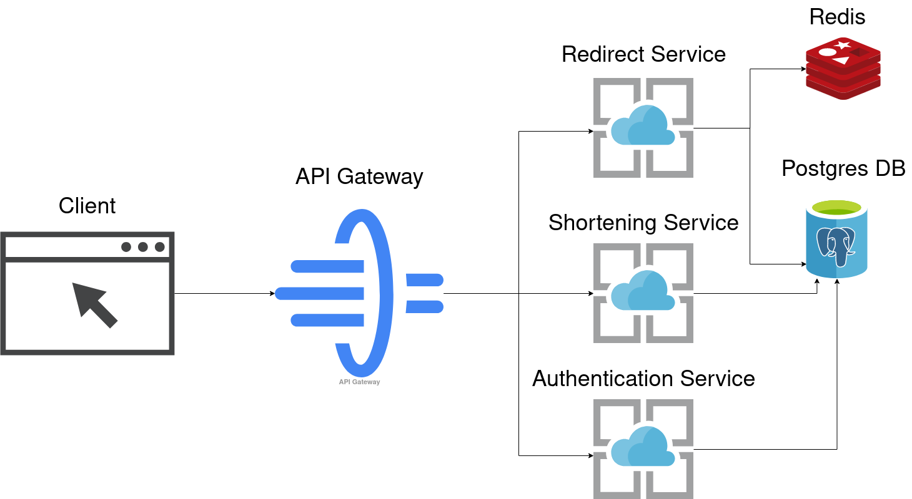

## Shortening\-API
[](https://golang.org/) [](LICENSE)

---
## 🚀 Overview
A **cloud-native** URL shortener composed of four Go microservices:

- **API-Gateway**
- **Auth**
- **Shortener**
- **Redirect**
 
Each service is designed for **modularity**, **scalability**, and **ease of maintenance**.

---

## 🏗 Architecture

This project follows a **microservices architecture** to ensure clear separation of concerns and independent scalability.



---

## ✨ Features

| Service       | Responsibilities                                                                                       |
| ------------- | ------------------------------------------------------------------------------------------------------ |
| **Gateway**   | - Reverse proxy for inbound requests  <br> - Authentication middleware blocks unauthorized users       |
| **Auth**      | - JWT-based authentication (RSA-256)  <br> - Access & refresh token issuance  <br> - Token claims injection & blacklisting  <br> - Public key endpoint exposure |
| **Shortener** | - URL hashing & Base62 encoding  <br> - Collision handling with retry logic                            |
| **Redirect**  | - HTTP 302 redirections for valid hashes  <br> - Redis caching for high-performance in-memory lookups  |

**Common Tools:**
- **sqlc**: Go code generation for PostgreSQL queries
- **goose**: Database migration management

---

## 🛠 Installation & Setup

1. **Clone the repository**
   ```bash
   git clone https://github.com/yourusername/shortening-api.git
   cd shortening-api
   ```

2. **Environment Variables**  
   Create a `.env` file in the project root with:
   ```env
   DB_URL="postgres://<user>:<password>@localhost:5432/<dbname>"
   GATEWAY_PORT=8080
   AUTH_PORT=8081
   SHORTENER_PORT=8082
   REDIRECT_PORT=8083
   ```
3. **Generate RSA Keys**
    - Create a `keys` directory under `config`
    - Generate and place your RSA-256 keys:
      ```bash
      mkdir -p config/keys
      openssl genrsa -out config/keys/private_key.pem 2048
      openssl rsa -in config/keys/private_key.pem -pubout -out config/keys/public_key.pem
      ```
4. **Install Dependencies**
   ```bash
   go install github.com/pressly/goose/v3/cmd/goose@latest
   go install github.com/sqlc-dev/sqlc/cmd/sqlc@latest
   ```
   > Make sure the PostgreSQL user in `DB_URL` has **CREATE**, **UPDATE**, **DELETE** permissions and can manage scheme and tables.

5. **Database Setup**
   ```bash
   # Run database migrations
   goose -dir sql/schema postgres "$DB_URL" up

   # Generate Go code for SQL queries
   sqlc generate
   ```
6. **Run Services**
   ```bash
   # From project root:
   go run ./cmd/gateway
   go run ./cmd/auth
   go run ./cmd/shortener
   go run ./cmd/redirect
   ```

---
> ⚠️ **Note:** This application is for **educational purposes** only and is not production-ready. Feel free to fork, modify, or submit pull requests.